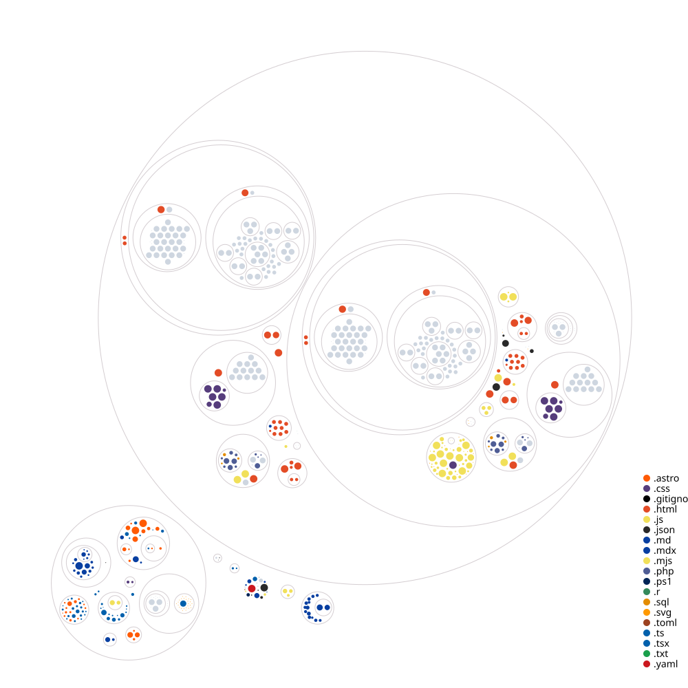

<!-- Logo -->
<h1 align="center">
  
</h1>

<!-- Copy -->
<h4 align="center">My personal site: an Astro + AstroPaper + Tailwind blog and portfolio, deployed to GitHub Pages.</h4>

<!-- Badges -->
<div align="center">
  <!-- Astro -->
  
  <!-- Docker -->
  
  <!-- CodeQL -->
  
  <!-- Gitleaks -->
  
  <!-- Version -->
  
  <!-- Issues -->
  
  <!-- Pull Requests -->
  
  <!-- License -->
  
</div>

<!-- Navigation -->
<p align="center">
  <a href="#key-features">Key Features</a> •
  <a href="#installation">Installation</a> •
  <a href="#usage">Usage</a> •
  <a href="#documentation">Documentation</a> •
  <a href="#support">Support</a> •
  <a href="#contributing">Contributing</a> •
  <a href="#credits">Credits</a> •
  <a href="#license">License</a>
</p>

<!-- Screenshot -->


**The live site is at [williamvdg.me](https://williamvdg.me).**

## Key Features

- A static Astro 7 blog on the AstroPaper theme, styled with Tailwind 4.
- Posts are Markdown with a Zod-validated schema, so a typo in frontmatter fails the build rather than publishing quietly.
- Per-post social preview images generated at build time with Satori.
- Client-side search over the whole site via Pagefind — no search backend.
- Projects, Labs, and Uses pages, plus a published Storybook style guide at `/styleguide`.
- Short-link redirects under `/r/`, and Google Maps contribution stats refreshed on a schedule.
- Deployed to GitHub Pages and mirrored as a Docker image on every push to `main`.

## Installation

```bash
git clone https://github.com/willtheorangeguy/willtheorangeguy.github.io.git
cd willtheorangeguy.github.io
npm install
npm run dev
```

Then open `http://localhost:4321` — http, not https. Either npm or pnpm works locally; CI uses pnpm. Docker and production builds are covered in [`docs/installation.md`](docs/installation.md).

## Usage

Posts are Markdown files in `src/data/blog/`:

```markdown
---
title: A title
pubDatetime: 2026-08-19T10:00:00Z
description: One sentence, used for previews and the generated OG image.
---

Body copy.
```

`title`, `pubDatetime`, and `description` are required; `tags`, `draft`, `featured`, and the rest are optional and documented in [`docs/usage.md`](docs/usage.md).

Search is powered by Pagefind, which indexes built output — it works after `npm run build && npm run preview`, not under `npm run dev`.

## Documentation

Full documentation lives in [`docs/`](docs/index.md):
[Installation](docs/installation.md) · [Quickstart](docs/quickstart.md) · [Usage](docs/usage.md) · [Configuration](docs/configuration.md) · [Architecture](docs/architecture.md) · [Development](docs/development.md) · [Deployment](docs/deployment.md) · [Google Maps automation](docs/google-maps-automation.md) · [FAQ](docs/faq.md) · [Troubleshooting](docs/troubleshooting.md) · [Roadmap](docs/roadmap.md)

Legal text served by the site lives in [`docs/legal/`](docs/legal/): [Privacy Policy](docs/legal/privacy.md) and [Terms and Conditions](docs/legal/terms.md).



## Support

Open a [GitHub Discussion](https://github.com/willtheorangeguy/willtheorangeguy.github.io/discussions/new) or file an [issue](https://github.com/willtheorangeguy/willtheorangeguy.github.io/issues/new/choose).

## Contributing

Contributions welcome. See the org-wide [Contributing Guide](https://github.com/willtheorangeguy/.github/blob/main/CONTRIBUTING.md) and [Code of Conduct](https://github.com/willtheorangeguy/.github/blob/main/CODE_OF_CONDUCT.md).

## Credits

This software uses the following open source packages, projects, services or websites:

<!-- Credits Table -->
<table>
  <tr>
    <th align="center"></th>
    <th align="center"></th>
    <th align="center"></th>
    <th align="center"></th>
    <th align="center"></th>
  </tr>
  <tr>
    <td align="center">Astro</td>
    <td align="center">AstroPaper</td>
    <td align="center">Tailwind CSS</td>
    <td align="center">W3C</td>
    <td align="center">Simple Analytics</td>
  </tr>
  <tr>
    <td align="center"><a href="https://astro.build/">Web</a></td>
    <td align="center"><a href="https://github.com/satnaing/astro-paper">GitHub</a></td>
    <td align="center"><a href="https://tailwindcss.com/">Web</a> - <a href="https://github.com/tailwindlabs/tailwindcss">GitHub</a></td>
    <td align="center"><a href="https://www.w3.org">Web</a> - <a href="https://www.w3.org/support/">Donate</a></td>
    <td align="center"><a href="https://simpleanalytics.com/?referral=willtheorangeguy">Web</a> - <a href="https://www.simpleanalytics.com/pricing">Plans</a></td>
  </tr>
</table>

## Contributors

- [@willtheorangeguy](https://github.com/willtheorangeguy) - Sponsor on [PayPal](https://paypal.me/wvdg44?country.x=CA&locale.x=en_US)
- [@JASKIRAT11011](https://github.com/JASKIRAT11011)

## License

This project is licensed under the [MIT License](https://mit-license.org/) - see the [`LICENSE`](LICENSE.md) file for details. See the [Privacy Policy](docs/legal/privacy.md) and [Terms and Conditions](docs/legal/terms.md) for legal information.
