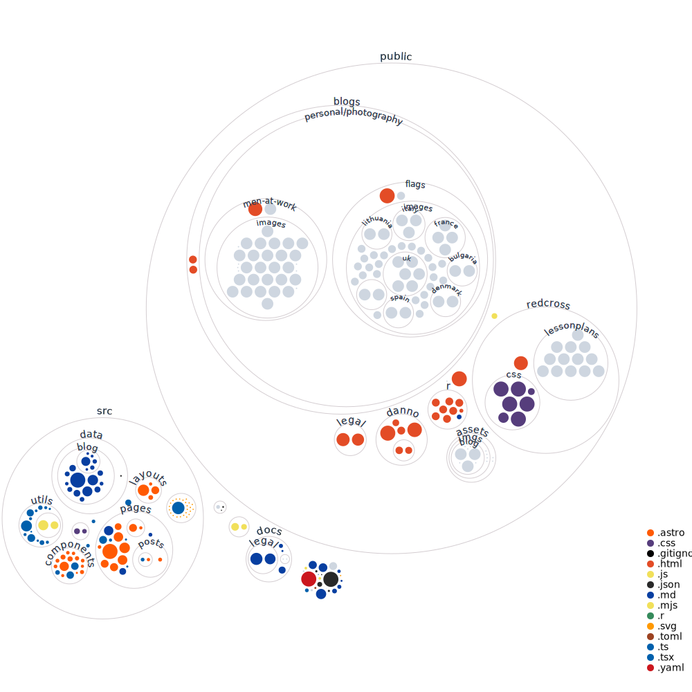

<!-- Logo -->
<h1 align="center">
  
</h1>

<!-- Copy -->
<h4 align="center">My personal Astro + Astro Paper + Tailwind + Github Pages site.</h4>

<!-- Badges -->
<div align="center">
  <!-- Stability -->
  
  <!-- Stability -->
  
  <!-- Prettier Lint -->
  
  <!-- CodeQL -->
  
  <!-- Gitleaks -->
  
  <!-- Version -->
  
  <!-- Issues -->
  
  <!-- Pull Requests -->
  
  <!-- Discord -->
  
  <!-- Language Count -->
  
</div>

<!-- Navigation -->
<p align="center">
  <a href="#key-features">Key Features</a> •
  <a href="#how-to-use">How To Use</a> •
  <a href="#contributing">Contributing</a> •
  <a href="#changelog">Changelog</a> •
  <a href="#credits">Credits & Contributors</a>
</p>

<!-- Screenshot(s) -->


## Key Features

-   Uses the Astro build system to create a static blog.
-   Stylized with Tailwind CSS and the Astro Paper theme.
-   Projects, Labs, and Uses pages.
-   Displays links to all of my personal projects.
-   Cross platform, web browser based.

## How To Use

**To access the latest version of the website visit it at [williamvdg.me](https://willtheorangeguy.github.io/).**

**To clone and run your own copy of this website**, you'll need [Git](https://git-scm.com/downloads) installed on your computer. If you would rather not use Git, you can just download the code from GitHub [above](https://github.com/willtheorangeguy/willtheorangeguy.github.io/archive/refs/heads/main.zip). From your command line:

```bash
# Clone this repository
$ git clone https://github.com/willtheorangeguy/willtheorangeguy.github.io.git

# Go into the repository
$ cd willtheorangeguy.github.io

# Run Astro
$ npm run dev
```

You can also pull the [Docker](https://www.docker.com/) image from GitHub Packages. From your command line:

```bash
# Pull image
$ docker pull ghcr.io/willtheorangeguy/willtheorangeguy.github.io:main

# Run container
$ docker run -d -p 8000:80 ghcr.io/willtheorangeguy/willtheorangeguy.github.io:main

# Now, navigate to localhost in your browser to see the webpage
```

If support is required, please open a **[GitHub Discussion](https://github.com/willtheorangeguy/willtheorangeguy.github.io/discussions/new)** or join our **[Discord](https://discord.gg/axMJXSRvTJ)**.

## Contributing

Please contribute using [GitHub Flow](https://guides.github.com/introduction/flow). Create a branch, add commits, and [open a pull request](https://github.com/willtheorangeguy/willtheorangeguy.github.io/compare).

Please read [`CONTRIBUTING`](CONTRIBUTING.md) for details on our [`CODE OF CONDUCT`](CODE_OF_CONDUCT.md), and the process for submitting pull requests to us.

## Changelog

See the [`CHANGELOG`](CHANGELOG.md) file for details.



## Credits

This software uses the following open source packages, projects, services or websites:

<!-- Credits Table -->
<table>
  <tr>
    <th align="center"></th>
    <th align="center"></th>
    <th align="center"></th>
    <th align="center"></th>
    <th align="center"></th>
  </tr>
  <tr>
    <td align="center">Astro</td>
    <td align="center">AstroPaper</td>
    <td align="center">Tailwind CSS</td>
    <td align="center">W3C</td>
    <td align="center">Simple Analytics</td>
  </tr>
  <tr>
    <td align="center"><a href="https://astro.build/">Web</a></td>
    <td align="center"><a href="https://github.com/satnaing/astro-paper">GitHub</a></td>
    <td align="center"><a href="https://tailwindcss.com/">Web</a> - <a href="https://github.com/tailwindlabs/tailwindcss">GitHub</a></td>
    <td align="center"><a href="https://www.w3.org">Web</a> - <a href="https://www.w3.org/support/">Donate</a></td>
    <td align="center"><a href="https://simpleanalytics.com/?referral=willtheorangeguy">Web</a> - <a href="https://www.simpleanalytics.com/pricing">Plans</a></td>
  </tr>
</table>

## Contributors

-   [@willtheorangeguy](https://github.com/willtheorangeguy) - Sponsor on [PayPal](https://paypal.me/wvdg44?country.x=CA&locale.x=en_US)
-   [@JASKIRAT11011](https://github.com/JASKIRAT11011)

## You may also like...

-   [Running Calculator](https://github.com/willtheorangeguy/Running-Calculator) - A running speed calculator for any unit of distance.
-   [Python Logo Widgets](https://github.com/willtheorangeguy/Python-Logo-Widgets) - Python Powered Logo widgets that can be added to any GUI project.
-   [Random Lotto Number Chooser](https://github.com/willtheorangeguy/Random-Lotto-Number-Chooser) - Randomly pick lucky lotto numbers.

## License

This project is licensed under the [MIT License](https://mit-license.org/) - see the [`LICENSE`](LICENSE.md) file for details. See the [Privacy Policy](https://github.com/willtheorangeguy/willtheorangeguy.github.io/blob/main/docs/legal/PRIVACY.md) and [Terms and Conditions](https://github.com/willtheorangeguy/willtheorangeguy.github.io/blob/main/docs/legal/TERMS.md) for legal information.
